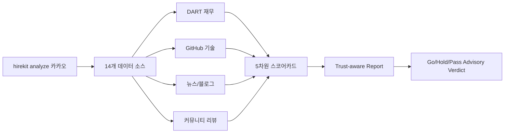
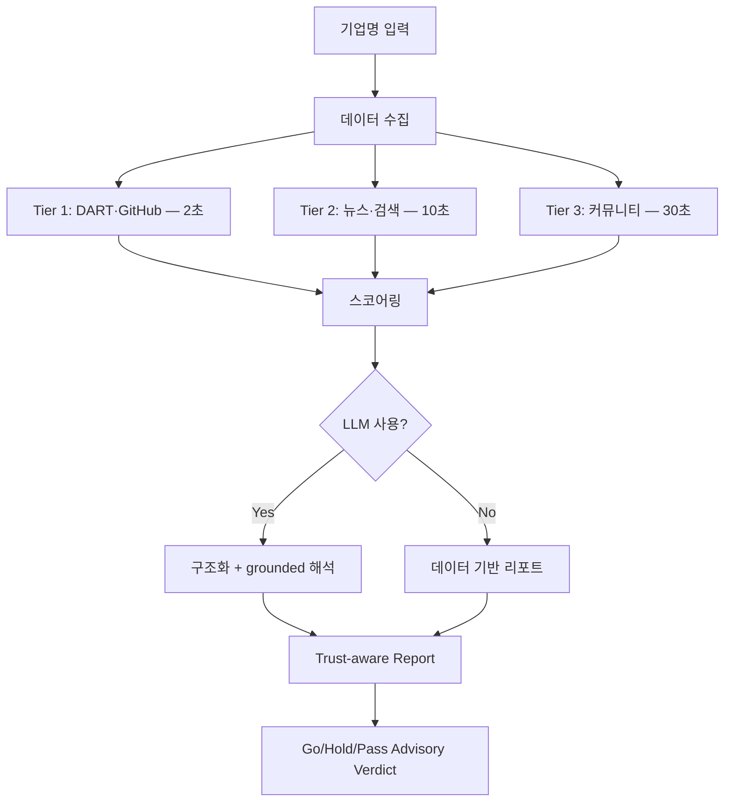

<p align="center">
  <h1 align="center">🎯 HireKit</h1>
  <p align="center">
    <strong>Career Intelligence Terminal for job seekers</strong>
  </p>
  <p align="center">
    14개 소스 수집 → trust-first scorecard → advisory verdict → proof-of-work
  </p>
</p>

<p align="center">
  <a href="https://pypi.org/project/hirekit/"></a>
  <a href="https://www.python.org/downloads/"></a>
  <a href="https://github.com/zihoshin-dev/hirekit/blob/main/LICENSE"></a>
  <a href="https://github.com/zihoshin-dev/hirekit/actions"></a>
  <a href="https://zihoshin-dev.github.io/hirekit"></a>
</p>

<p align="center">
  한국어 | <a href="README.ko.md">한국어 (상세)</a> | <a href="https://zihoshin-dev.github.io/hirekit">데모</a>
</p>

---

> 🔗 **[라이브 데모 — 79개 기업 공개 스냅샷 보기](https://zihoshin-dev.github.io/hirekit)**

---

기업 하나를 제대로 파악하려면 DART 공시, 뉴스, 기술 블로그, 커뮤니티 리뷰... 탭을 10개 넘게 열어야 해요.
HireKit은 그 과정을 `Career Intelligence Terminal`로 압축해요. 기업 리서치, JD 해석, 이력서 판단을 연결해서 `Go / Hold / Pass` 권고까지 내려줘요.

중요: `Go / Hold / Pass`는 **advisory verdict**예요. 합격을 보장하지 않고, 공개 데모는 **GitHub Pages 정적 스냅샷**만 보여줘요. 이력서/JD 같은 개인 데이터는 공개 경로에 저장하지 않아요.

```bash
pip install hirekit
hirekit analyze 카카오
```

---

## 아키텍처



---

## 분석 파이프라인



---

## Quick Start

### 1. 설치

```bash
pip install hirekit
```

Python 3.11 이상이면 충분해요. 공개 데모는 정적 스냅샷이고, 실제 분석은 로컬에서 실행돼요.

### 2. (선택) API 키 설정

```bash
hirekit configure
# ~/.hirekit/.env 파일에 키를 붙여넣으세요
```

### 3. 첫 분석

```bash
hirekit analyze 카카오
```

```
                   카카오 Scorecard
┌─────────────────────┬────────┬────────┬──────────────────┐
│ 평가 항목           │ 가중치 │  점수  │ 근거             │
├─────────────────────┼────────┼────────┼──────────────────┤
│ 직무 적합도         │    30% │  3.5/5 │ 기술 스택 확인됨 │
│ 경력 레버리지       │    20% │  4.6/5 │ 15개 데이터 수집 │
│ 성장 가능성         │    20% │  4.5/5 │ 재무+뉴스 확인   │
│ 보상/복지           │    15% │  3.5/5 │ DART 연봉 데이터 │
│ 문화 적합도         │    15% │  4.5/5 │ 리뷰+Exa 분석    │
│ 종합                │        │ 82/100 │ 등급 S           │
└─────────────────────┴────────┴────────┴──────────────────┘
```

리포트는 `./reports/카카오_analysis.md`에 저장돼요.

---

## 5차원 스코어카드

| 차원 | 가중치 | 데이터 소스 | 측정 방법 |
|------|--------|------------|----------|
| 🎯 **Job Fit** | 30% | GitHub, 기술블로그 | 기술 성숙도, 오픈소스 활동 |
| 📈 **Growth** | 20% | DART 재무 | 매출/영업이익 성장률 |
| 💰 **Compensation** | 15% | DART 인사 | 평균 연봉, 근속연수 |
| 🤝 **Culture Fit** | 15% | 네이버, Exa | 리뷰 다양성, 블로그 분석 |
| 🚀 **Career Leverage** | 20% | 종합 | 기업 규모, 브랜드, 뉴스 |

---

## 명령어 가이드

| 명령어 | 설명 | 주요 기능 |
|--------|------|----------|
| `hirekit analyze 카카오` | 기업 종합 분석 | 14개 소스, 5차원 스코어, 12섹션 리포트 |
| `hirekit match --jd "URL"` | JD 매칭 | 60+ 기술 taxonomy, 3단계 매칭, 학습 로드맵 |
| `hirekit interview 카카오` | 면접 준비 | 200+ 질문, STAR 가이드, 기업별 문화핏 |
| `hirekit resume resume.txt` | 이력서 분석 | 정량 피드백, ATS 최적화, Before→After |
| `hirekit coverletter 카카오 --position PM` | 자소서 분석 | 클리셰 감지 100+, 차별화 점수 |
| `hirekit proof 카카오 --role 백엔드 --experience 5` | 실행 메모 | advisory verdict를 바로 지원 액션 메모로 압축 |
| `hirekit strategy 카카오 --role PM --output json` | 커리어 전략 | 적합도, 스킬 갭, 준비 기간, 대안 기업 |
| `hirekit compare 카카오 네이버 --output json` | 기업 비교 | 7차원 비교, 차원별 승자, 종합 추천 |
| `hirekit jobs 쿠팡 -o json` | 채용 공고 탐색 | 기업별 현재 포지션 조회, JSON 자동화 연동 |
| `hirekit pipeline 카카오 --current 라인 --skills "python,kafka" --compare 네이버` | 워룸 파이프라인 | 5단계 분석 + 개인화 전략 + 기업 비교 + advisory Go/Hold/Pass |

### `hirekit analyze` — 기업 분석

```bash
# 기본 분석 (Markdown 리포트 저장)
hirekit analyze 카카오

# 터미널에서 바로 확인
hirekit analyze 네이버 -o terminal

# JSON 출력 (스크립트 연동)
hirekit analyze 토스 -o json

# 간단 분석 (핵심 섹션만)
hirekit analyze 쿠팡 --tier 3
```

**결과물**: trust-aware 리포트 + 5차원 100점 스코어카드 + advisory verdict

---

### `hirekit match` — JD 매칭

```bash
# 채용공고 URL
hirekit match "https://www.wanted.co.kr/wd/12345"

# 텍스트 파일
hirekit match jd.txt

# 내 프로필과 함께 (맞춤 매칭)
hirekit match jd.txt --profile ~/.hirekit/profile.yaml
```

**결과물**: 매칭 점수(0–100), 스킬 갭, 강점, 지원 전략

---

### `hirekit interview` — 면접 준비

```bash
# 기업 맞춤 면접 질문 생성
hirekit interview 카카오

# 직무 지정 (더 구체적인 질문)
hirekit interview 카카오 --position "백엔드 개발자"

# 터미널 출력
hirekit interview 네이버 --position PM -o terminal
```

**결과물**: 공통 질문 5개 + 직무 질문 + STAR 답변 프레임 + 역질문 5개

---

### `hirekit resume` — 이력서 분석

```bash
# 이력서 파일 분석 (md, txt, pdf)
hirekit resume 이력서.md

# JD 대비 분석 (키워드 갭 포함)
hirekit resume 이력서.md --jd "https://wanted.co.kr/wd/12345"
```

**결과물**: ATS 호환성, 구조 분석, 키워드 갭, 콘텐츠 점수, 개선 제안

---

### `hirekit coverletter` — 자소서 분석

```bash
# 자소서 4항목 초안 + 피드백
hirekit coverletter 카카오 --position PM

# 내 프로필로 맞춤 자소서
hirekit coverletter 토스 --position PM --profile profile.yaml
```

**결과물**: 4항목 초안 (성장과정·지원동기·직무역량·장단점) + 클리셰 감지 + 항목별 점수

---

### `hirekit proof` — 실행 메모

```bash
# 기업 분석을 바로 액션 메모로 압축
hirekit proof 카카오 --no-llm

# JD / 이력서 / 커리어 정보까지 반영
hirekit proof 토스 --jd jd.txt --resume resume.md --role 백엔드 --experience 5 --skills "python,aws,kafka"
```

**결과물**: verdict, 핵심 근거, 바로 할 일, low-confidence guardrail, 개인화 전략 요약

---

### `hirekit panel` — 전문가 패널

```bash
# 여러 렌즈로 지원 결정을 한 번에 요약
hirekit panel 카카오 --role 백엔드 --experience 4 --skills "python,kafka" --compare 네이버 --compare 당근
```

**결과물**: Hiring/Engineering/Product/Risk/Career 렌즈별 판정, 합의 요약, 바로 할 일

---

### `hirekit strategy` — 커리어 전략

```bash
# 목표 기업 기준 적합도/갭 분석
hirekit strategy 카카오 --role PM --experience 5 --skills "sql,python,product"

# 프로필 YAML 기본값 사용 (경력/트랙/스킬 자동 반영)
hirekit strategy 토스 --profile ~/.hirekit/profile.yaml

# 자동화용 JSON 출력
hirekit strategy 네이버 --role backend --skills "python,aws,kafka" --output json
```

**결과물**: 적합도 점수, 접근 전략, 스킬 갭, 준비 기간, 대안 기업

프로필 YAML을 주면 `years_of_experience`, `current_role`, `tracks`, `skills`, `education`
기본값을 읽어 와서 CLI 입력을 덜 반복하게 해줘요. 명시한 CLI 옵션은 프로필 값보다 우선해요.

---

### `hirekit compare` — 기업 비교

```bash
# 2개 기업 비교
hirekit compare 카카오 네이버

# 3개 기업 비교 + JSON 출력
hirekit compare 카카오 네이버 토스 --output json
```

**결과물**: 성장/보상/문화/기술/브랜드/WLB/원격근무 7차원 비교 + 종합 추천

---

### `hirekit pipeline` — 워룸 파이프라인

```bash
# 기본 파이프라인
hirekit pipeline 카카오 --no-llm

# 현재 회사/경력/기술을 함께 넣어 전략 연결
hirekit pipeline 카카오 --current 라인 --current-role 백엔드 --position 백엔드 --experience 4 --skills "python,kafka,aws"

# 비교 기업까지 넣어 워룸처럼 판단
hirekit pipeline 카카오 --position PM --skills "sql,python,product" --compare 네이버 --compare 당근
```

**결과물**: Hero Verdict + Proof of Work + 개인화 전략 + 비교 요약이 한 리포트에 함께 들어가요. `--compare`를 생략해도 전략 엔진이 대안 기업을 찾으면 워룸 비교에 자동으로 연결해요.

---

### `hirekit jobs` — 채용 공고 탐색

```bash
# 터미널에서 현재 공고 확인
hirekit jobs 쿠팡

# JSON으로 전체 공고 추출
hirekit jobs 네이버 --output json
```

**결과물**: 현재 채용 포지션 목록, 부서/위치/고용형태/게시일 정보

---

### `hirekit sources` — 소스 상태 확인

```bash
hirekit sources
```

```
                   Data Sources
┌──────────────────┬────────┬─────────────────┬──────────────┐
│ 소스             │ 지역   │ API 키          │ 상태         │
├──────────────────┼────────┼─────────────────┼──────────────┤
│ dart             │ KR     │ DART_API_KEY    │ Ready        │
│ github           │ GLOBAL │ -               │ Ready        │
│ google_news      │ GLOBAL │ -               │ Ready        │
│ naver_news       │ KR     │ NAVER_CLIENT_ID │ 미설정       │
│ tech_blog        │ KR     │ -               │ Ready        │
│ community_review │ KR     │ -               │ Ready        │
└──────────────────┴────────┴─────────────────┴──────────────┘
```

---

## Claude Code에서 바로 사용하기

HireKit은 Claude Code 세션 안에서 자연스럽게 동작해요.

### 슬래시 명령어

```
/analyze 카카오        — 기업 분석 + AI 해석
/interview 카카오      — 면접 질문 생성 + STAR 가이드
/match <JD-URL>       — JD 매칭 + 갭 분석
```

### 자연어 자동 트리거

"카카오 어떤 회사야?", "면접 준비해줘" 같은 자연어로도 HireKit이 자동 호출돼요.

---

## 데이터 소스 (14개)

| 소스 | 지역 | 데이터 | API 키 필요 |
|------|------|--------|:-----------:|
| **DART** | 🇰🇷 | 재무제표, 직원수, 평균연봉 (금감원 공시) | ✅ |
| **네이버 뉴스** | 🇰🇷 | 최신 뉴스 기사 | ✅ |
| **네이버 검색** | 🇰🇷 | 블로그 면접후기, 카페 리뷰 | ✅ |
| **기술 블로그** | 🇰🇷 | 사내 기술 블로그, 개발 문화 | ❌ |
| **커뮤니티 리뷰** | 🇰🇷 | 블라인드·잡플래닛 요약 | ❌ |
| **GitHub** | 🌐 | 기술 성숙도 (리포·스타·언어) | ❌ (gh CLI) |
| **Google News** | 🌐 | RSS 기반 최신 뉴스 | ❌ |
| **해외 주요 언론** | 🌐 | Reuters, Bloomberg, FT, WSJ, 한경 | ❌ |
| **회사 공식 웹사이트** | 🌐 | 비전, 미션, 주요 공지 | ❌ |
| **채용 페이지** | 🌐 | JD, 복지, 채용 문화 | ❌ |
| **Medium / Velog** | 🌐 | 개발자 기고, 기술 트렌드 | ❌ |
| **LinkedIn 검색** | 🌐 | 팀 규모, 직군 분포 | ❌ |
| **Brave Search** | 🌐 | 웹+뉴스 시맨틱 검색 | ✅ |
| **Exa Search** | 🌐 | AI 기반 딥서치 | ✅ |

> API 키가 **하나도 없어도** Google News, 해외 주요 언론, 기술 블로그, 커뮤니티 리뷰, GitHub(gh CLI 설치 시) 등 8개 소스가 바로 동작해요.

---

## 프라이버시

- 모든 데이터 처리는 **로컬**에서 실행돼요
- 수집한 데이터를 외부 서버로 전송하지 않아요
- API 키는 `~/.hirekit/.env`에 직접 관리해요
- LLM(AI)을 연결해도 프롬프트만 해당 API에 전달돼요
- GitHub Pages 데모는 **공개 스냅샷**만 보여줘요. 개인 이력서/JD/메모는 공개 경로에 저장하지 않아요

---

## Contributing

기여를 환영해요! 시작하기 좋은 작업들:

- 새로운 데이터 소스 추가 (Glassdoor, SEC Edgar 등)
- 자소서 템플릿·클리셰 DB 확장
- 스코어링 알고리즘 개선

자세한 내용은 [CONTRIBUTING.md](CONTRIBUTING.md)를 참고해주세요.

---

## 라이선스

MIT License — [LICENSE](LICENSE)

<p align="center">
  <sub>더 나은 도구를 가질 자격이 있는 모든 취업 준비자를 위해.</sub>
</p>
